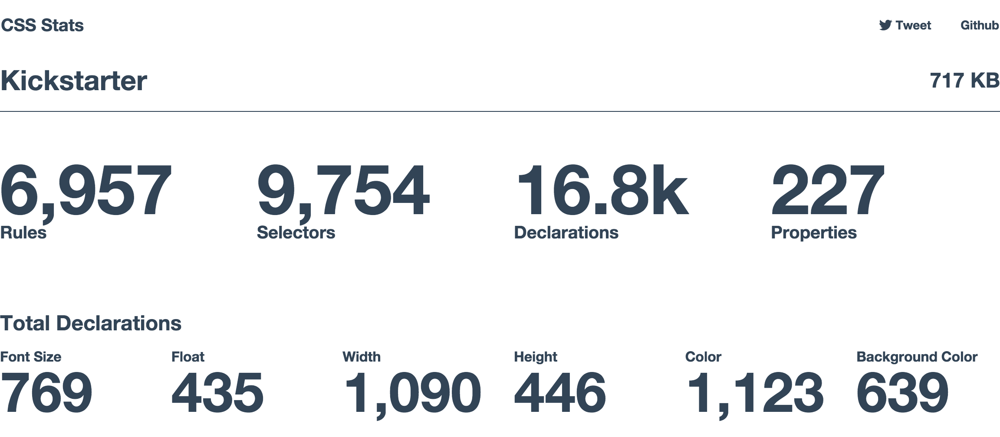
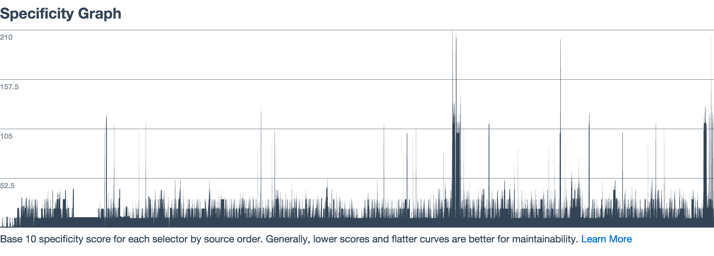
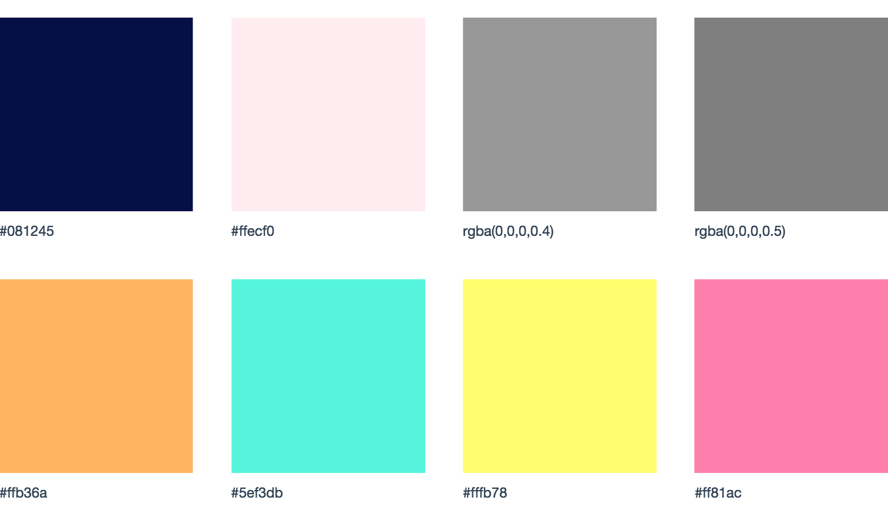
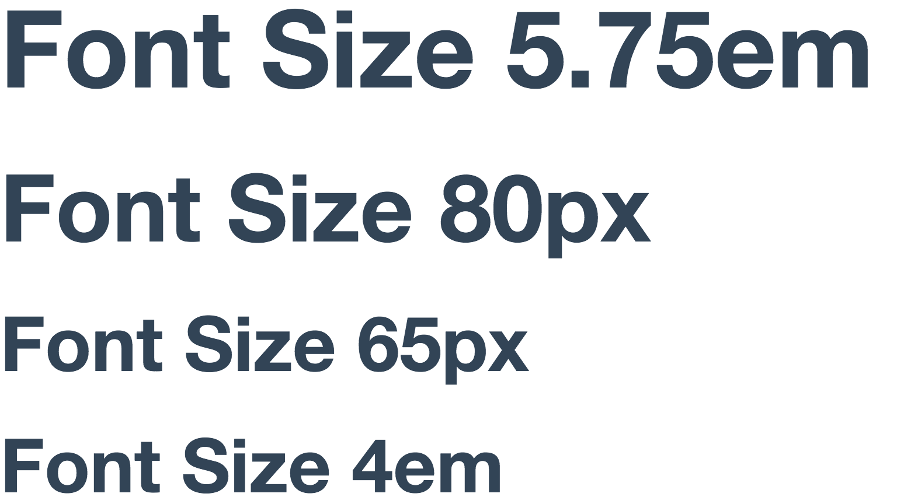
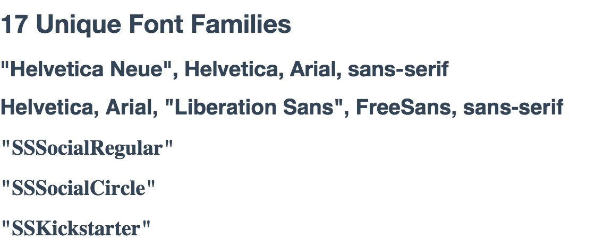

<a title="Visualize statistics for your CSS" href="http://cssstats.com" target="_blank">CSS Stats</a>
===========================================

##Visualize statistics for your CSS

* Try the web app: <a target="_blank" href="http://cssstats.com" title="Try cssstats to generate visualizations for any website's CSS stats" target="_blank">http://cssstats.com</a> 
* <a title="Share cssstats with others" href="https://twitter.com/intent/tweet?text=Visualize statistics for your css:&amp;url=http://cssstats.com" target="_blank"> **Tweet**  </a> 

###Examples




#Table of Contents
* [Thinking](#thinking)
* [Start using cssstats](#start-using-cssstats)
* [More examples](#more-examples)
* [Local project setup](#local-project-setup)
* [What is included](#what-is-included)
* [Directory structure](#directory-structure)
* [Authors](#authors)
* [License](#license)


##Thinking

>_A complex system that works is invariably found to have evolved from a simple system that worked. A complex system designed from scratch never works and cannot be patched up to make it work. You have to start over with a working simple system._
--<cite><a href="http://en.wikipedia.org/wiki/John_Gall_%28author%29" target="_blank" title="">John Gall (1975, p.71), Systemantics: How Systems Really Work and How They Fail</a></cite>

##Start using cssstats

* **33 KB zipped, 221 KB on disk unzipped**
* Try the web app: <a title="Use cssstats now to visualize statistics for your CSS" target="_blank" href="http://cssstats.com" target="_blank">http://cssstats.com</a> 

* Run locally: <a title="A link to node.js - a tool for building network applications"href="http://nodejs.org/" target="_blank">Install node.js</a> (required)
    * ```git clone git@github.com:mrmrs/cssstats.git```
    * ```cd cssstats``` 
    * ```npm install && npm start ```
    * ```http://localhost:3000```

##More Examples

**Colors in use**


**Font sizes in use**


**Fonts in use**


##Local Project Setup

###Global Dependencies

<a href="http://www.nodejs.org" title="Link to node.js install" target="_blank">Install node.js</a> to run cssstats locally. 

###Git Install

If you have git installed you can clone the repo.

```
git clone git@github.com:mrmrs/cssstats.git
cd cssstats
npm install && npm start
```
You can then open your browser to (http://localhost:3000) to see it running locally

If you want to edit css for your local application you can run
```
npm run css
```
This will regenerate base.min.css which is currently included in the head of the app.

##What is included

* <a href="https://github.com/gulpjs/gulp/" target="_blank" title="Automate build system tasks with gulp.js">gulp.js</a> - Build system that automates tasks
* <a href="https://github.com/matthewhartman/base/" target="_blank" title="A CSS framework for responsive sites">Base.css</a> - Responsive CSS framework
* <a href="https://github.com/wycats/handlebars.js/" target="_blank" title="Semanticlly build web templates">Handlebars.js</a> - Semantic web templating tool

##Directory Structure

```

├── README.md
├── bin
│   └── www
├── bower.json
├── controllers
│   ├── index.js
│   └── stats.js
├── css
│   ├── base.css
│   ├── color
│   │   ├── base.css
│   │   ├── borders.css
│   │   ├── buttons.css
│   │   ├── colors.css
│   │   ├── forms.css
│   │   ├── highlight.css
│   │   └── tables.css
│   ├── print.css
│   ├── uncss-ignore.js
│   └── utility
│       ├── forms.css
│       ├── layout.css
│       └── typography.css
├── gulpfile.js
├── helpers
│   ├── bar-chart.js
│   ├── encode.js
│   ├── highlight.js
│   ├── humanize.js
│   ├── inspect.js
│   ├── line-graph.handlebars
│   ├── line-graph.js
│   ├── pluralize.js
│   └── uniques-graph.js
├── img
├── main.js
├── package.json
├── public
│   ├── css
│   │   └── base.min.css
│   ├── favicon.png
│   ├── humans.txt
│   └── svg
│       ├── octocat.svg
│       └── twitter.svg
├── routes
│   ├── index.js
│   ├── parse.js
│   └── stats.js
├── services
│   └── resource.js
└── views
    ├── error.handlebars
    ├── index.handlebars
    ├── layouts
    │   └── application.handlebars
    ├── partials
    │   ├── error.handlebars
    │   ├── footer.handlebars
    │   └── nav.handlebars
    └── stats.handlebars

15 directories

```

##Authors

**Made with** <a title="Authors of cssstats - mrsjxn" href="http://mrsjxn.com/" target="_blank">:blue_heart:</a> **by:**

* * *
<a title="cssstats author icon - mrmrs" href="https://soundcloud.com/mr_mrs" target="_blank"></a>  

<a href="https://twitter.com/mrmrs_" target="_blank" title="cssstats author Twitter - mrmrs">@mrmrs</a>

<a href="http://www.mrmrs.cc/" target="_blank" title="cssstats author portfolio - mrmrs">mrmrs.cc</a>

<a href="http://www.github.com/mrmrs" target="_blank" title="cssstats author github - mrmrs">github/mrmrs</a>

* * *
<a title="cssstats author icon - jxnblk" href="https://soundcloud.com/jxnblk" target="_blank"></a>

<a href="https://twitter.com/jxnblk" target="_blank" title="cssstats author Twitter - jxnblk">@jxnblk</a>

<a target="_blank" href="http://www.jxnblk.com" title="cssstats author portfolio - jxnblk">jxnblk.com</a>

<a target="_blank" href="http://www.github.com/jxnblk" title="cssstats author github - jxnblk">github/jxnblk</a>

* * *

<a target="_blank" href="http://opensource.org/licenses/MIT" title="MIT License - Open Source"><h2>License</h2></a>

<a target="_blank" href="http://opensource.org/licenses/MIT" title="MIT License - Open Source">The MIT License (MIT)</a>

<a target="_blank" href="http://opensource.org/licenses/MIT" title="MIT License - Open Source">Copyright (c) 2014</a>


